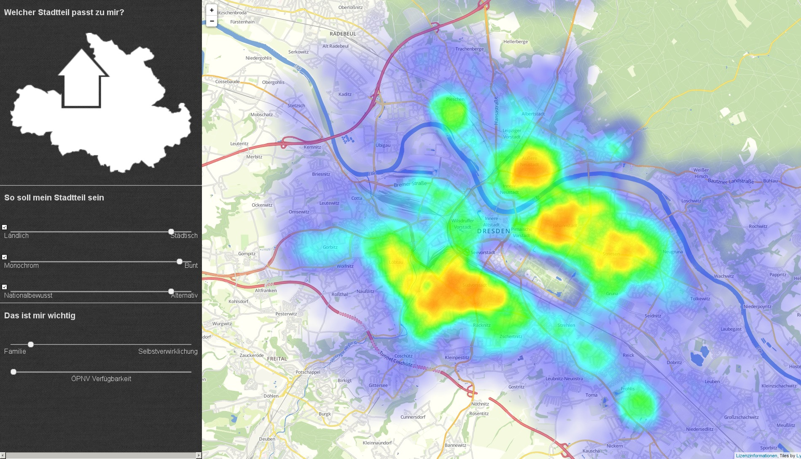

Our award-winning contribution to the [Open Data
Crunch](http://www.dresden.de/de/wirtschaft/wirtschaftsstandort/projekte-kooperationen/open-data-crunch.php)
competition during the [Datenspuren
2016](https://www.datenspuren.de/2016/fahrplan.html). 

[Try the application](https://thegreatwhiteshark.github.io/StadtteilsucheDD/index.html)

# Motivation
The problem we were tackling with this app was how to find an
appropriate place in a new and unknown city fitting best to a persons
needs. Or to put it simple: Which part of town fits me best? 

To answer this question, we solely use demographic data provided by
the city of Dresden.

If you are interested in the full story, check out the corresponding
[blog post](https://thegreatwhiteshark.github.io/thegreatwhiteshark.coding.io/data-science/stadtteilsuchedd/).

# Installation
## Via an Apache

One possible way to use this app is via an apache server.

``` bash
sudo apt install apache2
```

and copy the content of this repository to /var/www/html

## Via npm

Alternatively you can use [node.js](https://nodejs.org/en/).

``` bash
sudo npm install -g http-server
http-server
```
